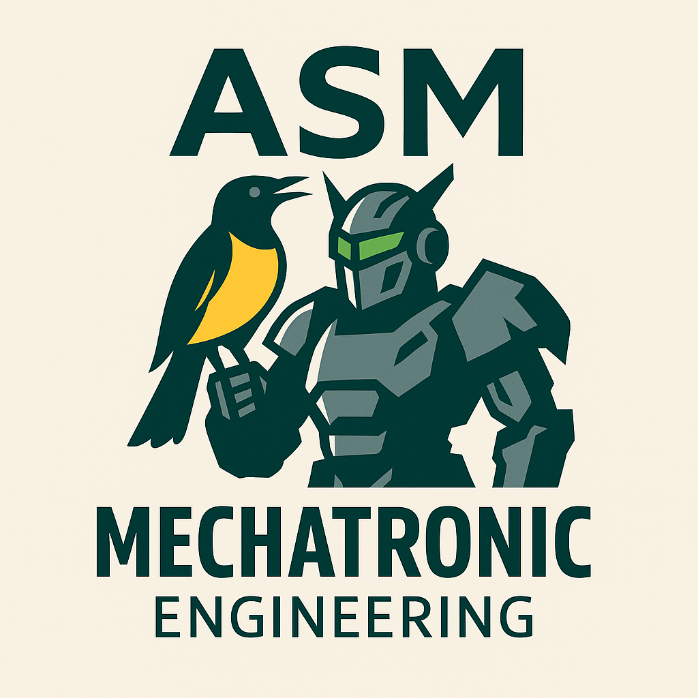

# Assembler – Low-Level Artistry in Code

Welcome to the **Assembler** repository — a poetic fusion of raw performance, legacy mastery, and deep hardware interaction. Here, you’ll find examples written in pure x86 Assembly, designed for **educational purposes**, **game development integration**, and **hardware emulation**.

> This repo complements our broader project **Valhalla Rising – The Parchment**, showcasing technical versatility for employers, professors, and creative studios.

---

## 🚀 What You'll Find Here

🧠 **Beginner-friendly Assembly code** using NASM/YASM syntax  
🕹️ **Use cases for game logic** and AI decision trees in low-level  
🎮 **Integration ideas with Godot (via Python wrappers)**  
📦 **Future plans to compile via WebAssembly (WASM)** for browser execution  

---

## 📂 Structure
